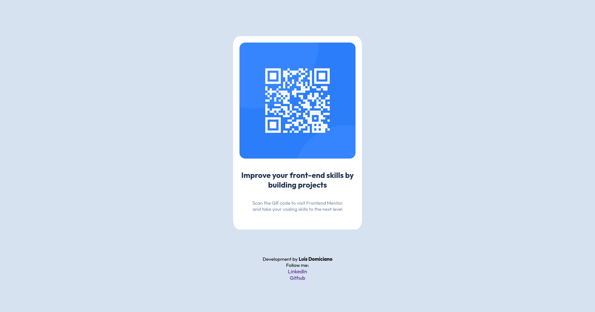

# Frontend Mentor - QR code component solution

This is my solution to the [QR code component challenge on Frontend Mentor](https://www.frontendmentor.io/challenges/qr-code-component-iux_sIO_H).  

## Table of contents

- [Overview](#overview)
  - [Screenshot](#screenshot)
  - [Links](#links)
- [My process](#my-process)
  - [Built with](#built-with)
  - [What I learned](#what-i-learned)
- [Author](#author)

## Overview

### Screenshot
#### Desktop

#### Mobile

### Links

- Solution URL: [Code Source](https://github.com/dmluis/qr-code-component-main)
- Live Site URL: [Live on Preview](https://dmluis.github.io/qr-code-component-main/)

## My process

### Built with

- Semantic HTML5 markup
- CSS custom properties
- Media Querie Css

### What I learned

I learned build a web page responsive with html, css and media queries.

## Author
- LinkedIn - [@LuisDomiciano](https://www.linkedin.com/in/luisdomiciano)
- Github - [@dmluis](https://github.com/dmluis)
- Frontend Mentor - [@dmluis](https://www.frontendmentor.io/profile/dmluis)
- Twitter - [@__LuisD](https://www.twitter.com/__LuisD)

